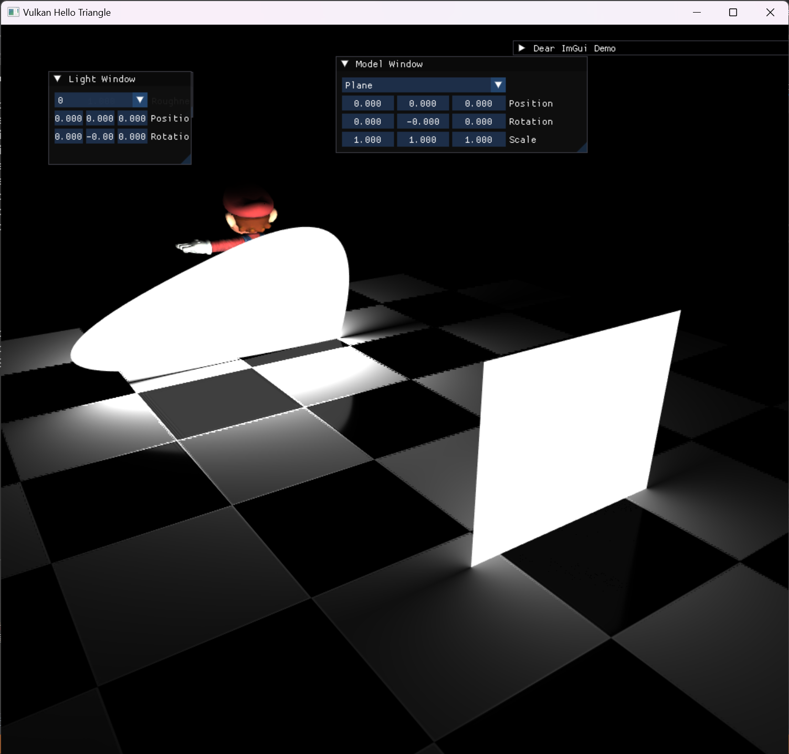
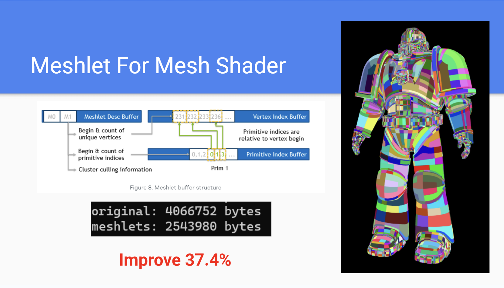
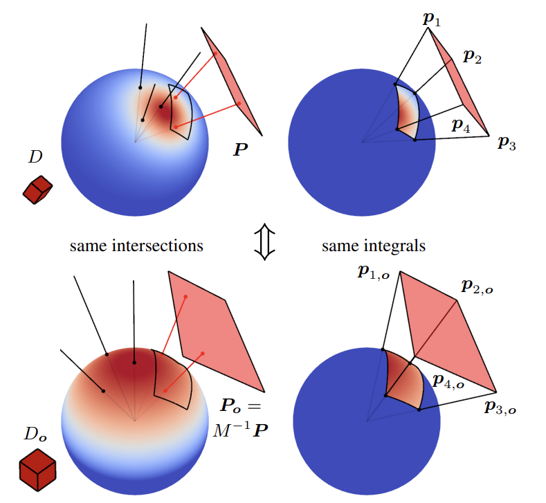
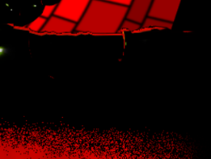
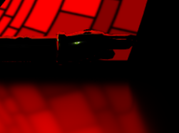
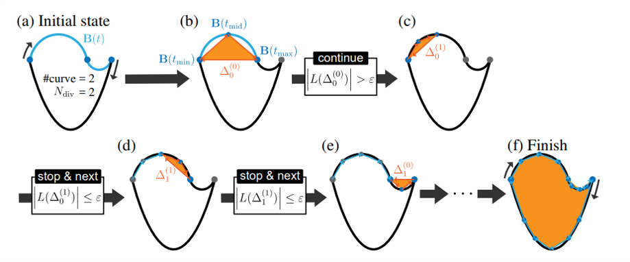
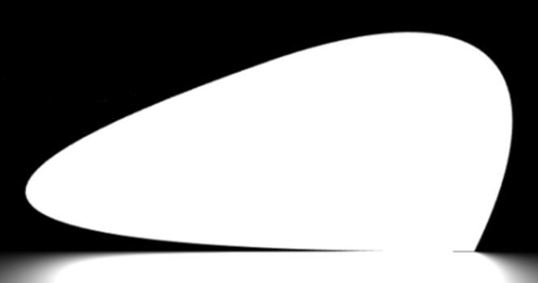

Vulkan Mesh Shader with Free-Form Planar Area Lights
==================================

**University of Pennsylvania, CIS 565: GPU Programming and Architecture, Fianl Project**

* Licheng Cao, Tianyi Xiao, Mengxuan Huang

## Description

In this project, we use Vulkan to build mesh shader render pipelines, which render scenes illuminated by free-form planar area lights.

  

## Mesh Shader

Different from traditional render pipeline, we used task shaders (optional) and mesh shader instead of vertex shaders, tessellation shaders and geometry shaders. Both task shaders and mesh shaders operate in workgroups, which are like compute shaders. Task shaders emit mesh shader workgroups and mesh shaders generate primitives for rasterization and fragment shaders.

What's more, we generate meshlets and pass them to mesh shader on CPU. We will have two index buffers to be passed, one for only vertex indices using uint, with their indices in original complete model data, and another one for triangle primitive indices with local indices per meshlet. The second index buffers use uint8_t since there won't be too many indices in each meshlet. Therefore we save the much memory bandwith.

  

As shown above, when rendering this robot model, we got 37.4% improvement in memory with meshlet.

## Free-Form Area Light

Also, we implemented real time free-form area light shading, which is mainly calculated in fragment shader. It is inspired by [a JCGT paper](https://jcgt.org/published/0011/01/01/), which is based on a previous [siggraph paper](https://eheitzresearch.wordpress.com/415-2/). In the previous siggraph paper, it introduced a method to shade polygon area light using Linearly Transformed Cosines(LTC). With this method, we transform area light from original space to LTC distribution space, where the light integration on the glossy surface could be caulculated as on the diffuse surface.

  

(an image shows how LTC works, from original paper)

### LTC Transformation 
To transform the area light into LTC distribution space, we need to multiply the light vertices with a specific matrix based on the view direction and roughness of the shading point. We store these matrices for the different view directions and roughnesses in a look-up texture, which is obtained by an optimization method that tries to minizie the error between the actual BRDF integration result and the result in the LTC distribution space. The result LTC matrix is a matrix that has values on m11, m13, m22, m31, m33. We can normalize the matrix with one of these values so that the information of the matrix could be stored in a `vec4` value. At first, we normalized the matrix with m33, which would introduce artifacts at the condition where the view direction is at grazing angle and the roughness is very low. So we changed the value from m33 to m22 to get a better result.

|normalized by m33| normalized by m22|
|:---:|:---:|
|||

### Light Integration
After we transformed light vertices with LTC distribution, we cliped the area that is under the shading plane. Then we calculate the integration for polygon area lights edge by edge with the method mentioned in the [paper](https://eheitzresearch.wordpress.com/415-2/). For free-form area lights, we represented them with bezier curves. To calculate their integrations, the curves are subdivided recursively until the bounded region of current curve segment is smaller than a dynamic threhold decided by fragment roughness. For bezier curves, we need to pay attention to the case where the bezier curves are nearly linear and we handle the curves as straight lines. The result of the integration shows the direction of the average light direction in the LTC distribution space, we use this to find the intersection of the light ray and the area light to get the UV of the light's texture.

  

(an image shows how LTC works, from original paper)

### Draw Free-Form Lights with Mesh Shader
Besides, we draw the bezier-curved light with help of mesh shader. We implemented the tessellation of bezier-curved area in task shader. First, we calculate the center of the area light. Then, we cut the curve into segments and use the segments and the center we calculated to build triangles. Lastly, we send the triangles to mesh shader and draw the final result.

  

(free-form light drawn by mesh shader)

### Textured Area Light
For both polygon and bezier curved light, we could assign texture to them for better visual effect.

  

(textured area light)

## Third Party Credit
- [Real-Time Shading of Free-Form Area Lights using Linearly Transformed Cosines](https://jcgt.org/published/0011/01/01/)

- [Real-Time Polygonal-Light Shading with Linearly Transformed Cosines](https://eheitzresearch.wordpress.com/415-2/)

- [Introduction to Turing Mesh Shaders](https://developer.nvidia.com/blog/introduction-turing-mesh-shaders/)

### Third party Resources
- [Subway Station & R46 Subway](https://sketchfab.com/3d-models/free-subway-station-r46-subway-ae5aadde1c6f48a19b32b309417a669b)
