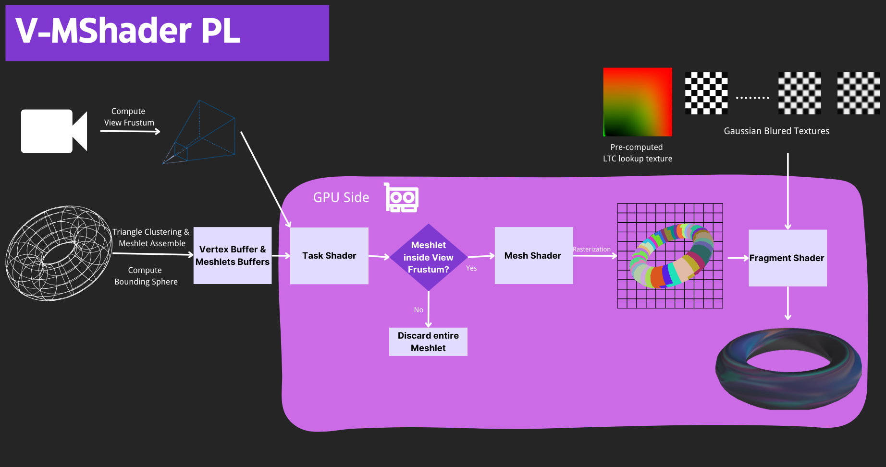

Vulkan Mesh Shader with Free-Form Planar Area Lights
==================================

**University of Pennsylvania, CIS 565: GPU Programming and Architecture, Fianl Project**
#### Group Members
* Mengxuan Huang [[LinkedIn](https://www.linkedin.com/in/mengxuan-huang-52881624a/)]
* Tianyi Xiao [[LinkedIn](https://www.linkedin.com/in/tianyi-xiao-20268524a/)]
* Licheng Cao [[LinkedIn](https://www.linkedin.com/in/licheng-cao-6a523524b/)]
#### Platform
* Windows 11, i9-13980HX @ 2.22GHz 64.0 GB, RTX4090-Laptop 16384MB

## Description

In our project, we have engineered a cutting-edge, real-time Vulkan renderer. This advanced system utilizes the mesh shader pipeline, a key feature that enables the efficient rendering of scenes illuminated by Free-Form Planar lights. This integration not only enhances the lighting realism but also optimizes performance, making it a powerful solution for dynamic and visually rich scenes.

  

## Flow Chart

  

This flowchart demonstrates the core rendering workflow of our project, which encompasses several key stages. It starts with meshlet computation, where the task shader may cull any meshlet falling outside the view-frustum based on its bounding sphere. The remaining meshlets will be processed by the mesh shader and the subsequent stages. Finally, The planar light shading will be performed in the fragment shader to produce high quality rendered image.

## Mesh Shader
### Introduction
In this project, our exploration of the mesh shader pipeline extends beyond traditional graphics rendering approaches. This advanced pipeline introduces two novel shading stages:
- **Task shaders:** Functioning optionally within the pipeline, serve to emit mesh shader workgroups. These workgroups, similar in nature to compute shaders, work cohesively within this advanced framework. 
- **Mesh shaders:** Core of this pipeline, are pivotal in generating primitives, which are subsequently processed by rasterization and fragment shaders. 

This approach not only streamlines the rendering process but also enhances the efficiency and flexibility of generating complex geometries in real-time graphics.

  

 Image from
<a href="https://developer.nvidia.com/blog/introduction-turing-mesh-shaders/">Introduction to Turing Mesh Shaders</a>

### Meshlets generation
In the mesh shader pipeline, we retained the original *Vertex Buffer* but introduced **3 New Buffers** for enhanced efficiency and detail:

1. **Meshlet Description Buffer**: This buffer contains essential data for each meshlet, including the **vertex count**, **primitive count**, **vertex begin index** (point to the **vertex index buffer**) and **primitive begin index** (point to the **primitive indices buffer**), and **bounding sphere** for view-frustum culling.

2. **Primitive Index Buffer**: Stores compact data (typically *uint8_t*) representing the local primitive indices within each meshlet.

3. **Vertex Index Buffer**: Contains more extensive data (usually *uint16_t* or *uint32_t*), representing the global vertex indices for the entire scene.

Compared to the original indices buffer, these buffers collectively enhance the pipeline's ability to handle complex geometries with less GPU memory requirement and efficiency.

The accompanying figures provide a detailed visual representation of various meshes(different color represent different meshlets), highlighting their respective statistical data. These visuals effectively illustrate the significant enhancements achieved through the implementation of meshlet, demonstrating both qualitative and quantitative improvements in GPU memory requirement.

|Astartes|Train|Station scene (with 2 Train and 1 Astartes)|
|:--------:|:--------:|:--------:|
||||
|338869 triangles|397622 triangles|1840394 triangles|
||||

### How it works ?

  

 Image from
<a href="https://developer.nvidia.com/blog/introduction-turing-mesh-shaders/">Introduction to Turing Mesh Shaders</a>

Each mesh shader initiates the process by utilizing the **task Id** provided by the task shader, coupling it with its own **WorkGroupID** and the **primitive begin index** to retrieve the **local primitive index** from the Primitive Index Buffer. Subsequently, it calculates the **global vertex index** by adding the **local primitive index** to the **primitive begin index**. The process concludes with the mesh shader accessing the requisite vertex data from the **vertex buffer**.

## Renderer Features
### View-Frustum Meshlet Culling
In addition to significantly optimizing GPU memory consumption, the Mesh Shader architecture offers a robust framework for more efficient view-frustum culling. This flexibility is a key advantage, enabling the rendering pipeline to intelligently determine which meshlets are within the viewing frustum and, thus, need to be processed.

#### Basic Algorithm

  

When assembling meshlets for meshes, it is also convenient and effective to compute a bounding sphere for each meshlet. Within the **task shader**, the bounding sphere is transformed and assessed to determine if it falls within the view-frustum. If the bounding sphere is indeed inside the view-frustum, the **mesh shaders** are launched for that specific meshlet, effectively processing it for rendering. Conversely, if the bounding sphere is outside the view-frustum, the **entire meshlet** is discarded promptly.

This selective approach to rendering not only streamlines GPU workload but also ensures that only relevant geometric data is processed and rendered, leading to considerable performance improvements as shown below.

#### Performance Analysis
**Test on the Station scene [12346170 triangles (12.34 millions)]**

||Without view-frustum culling| With view-frustum culling|
|:--------:|:--------:|:--------:|
|frame time:| 0.023s|0.006s|
|frame rate:| 43fps|166fps|

  

### Atlas Textures
To enhance the rendering of complex scenes with multiple textures, our approach involved the implementation of a texture atlas. This technique efficiently compresses multiple images into a single, large texture, thus utilizing only **one shader texture slot**. Additionally, we optimized our texture management by storing various texture types — including base color, normal, roughness, and metallic — within an Image Array. This strategy significantly conserves texture slots, enabling more efficient use of graphics resources and streamlined rendering performance.

  

The image depicted above illustrates a compressed Image Array, where each layer is strategically organized into two sections: the upper portion encompasses **20 large textures** for the Astartes model, whereas the lower part ingeniously compresses **232 smaller textures** for the intricate detailing of the train station and the train.

## Free-Form Area Light

Also, we implemented real time free-form area light shading, which is mainly calculated in fragment shader. It is inspired by [a JCGT paper](https://jcgt.org/published/0011/01/01/), which is based on a previous [siggraph paper](https://eheitzresearch.wordpress.com/415-2/). In the previous siggraph paper, it introduced a method to shade polygon area light using Linearly Transformed Cosines(LTC). With this method, we transform area light from original space to LTC distribution space, where the light integration on the glossy surface could be caulculated as on the diffuse surface.

  

(an image shows how LTC works, from original paper)

### LTC Transformation 
To transform the area light into LTC distribution space, we need to multiply the light vertices with a specific matrix based on the view direction and roughness of the shading point. We store these matrices for the different view directions and roughnesses in a look-up texture, which is obtained by an optimization method that tries to minizie the error between the actual BRDF integration result and the result in the LTC distribution space. The result LTC matrix is a matrix that has values on m11, m13, m22, m31, m33. We can normalize the matrix with one of these values so that the information of the matrix could be stored in a `vec4` value. At first, we normalized the matrix with m33, which would introduce artifacts at the condition where the view direction is at grazing angle and the roughness is very low. So we changed the value from m33 to m22 to get a better result.

|normalized by m33| normalized by m22|
|:---:|:---:|
|||

### Light Integration
After we transformed light vertices with LTC distribution, we cliped the area that is under the shading plane. Then we calculate the integration for polygon area lights edge by edge with the method mentioned in the [paper](https://eheitzresearch.wordpress.com/415-2/). For free-form area lights, we represented them with bezier curves. To calculate their integrations, the curves are subdivided recursively until the bounded region of current curve segment is smaller than a dynamic threhold decided by fragment roughness. For bezier curves, we need to pay attention to the case where the bezier curves are nearly linear and we handle the curves as straight lines. The result of the integration shows the direction of the average light direction in the LTC distribution space, we use this to find the intersection of the light ray and the area light to get the UV of the light's texture.

  

(an image shows how LTC works, from original paper)

### Draw Free-Form Lights with Mesh Shader
Besides, we draw the bezier-curved light with help of mesh shader in an additional pipeline only for light rendering. We implemented the tessellation of bezier-curved area in task and mesh shader. First, we calculate the center of the area light. Then, we cut the curve into segments. Lastly, we send each segment to one mesh shader, where each segment will form a triangle with the center point, and this triangle will be drawn.

  

(free-form light drawn by mesh shader)

### Textured Area Light
For both polygon and bezier curved light, we could assign texture to them for better visual effect.

  

(textured area light)

Same as the method introduced in the previous [paper](https://eheitzresearch.wordpress.com/415-2/), during integration stage, we calculate the average direction to each vertex of the light in LTC space and then interpolate with polygons to get the actual uv, and decide the blur level also according to the distance from fragment to the polygon plane and integration result.

What's more, we use a bounding square to map and interpolate the uv of curved light, for both curved texture lighting and curved texture light drawing.

## Third Party Credit
- [Real-Time Shading of Free-Form Area Lights using Linearly Transformed Cosines](https://jcgt.org/published/0011/01/01/)

- [Real-Time Polygonal-Light Shading with Linearly Transformed Cosines](https://eheitzresearch.wordpress.com/415-2/)

- [Introduction to Turing Mesh Shaders](https://developer.nvidia.com/blog/introduction-turing-mesh-shaders/)

### Third party Resources
- [Subway Station & R46 Subway](https://sketchfab.com/3d-models/free-subway-station-r46-subway-ae5aadde1c6f48a19b32b309417a669b)
- [Astartes of Steppe Hawks chapter Free 3D model](https://www.cgtrader.com/free-3d-models/character/sci-fi-character/astartes-of-steppe-hawks-chapter)
- [Keanu-reeves-cyberpunk-poster](https://aiartshop.com/products/keanu-reeves-cyberpunk-poster)
- [Cyberpunk-anime-girl-by-karpuz](https://www.redbubble.com/i/poster/blue-cyberpunk-anime-girl-by-karpuz-design/147463559.LVTDI)
- [cyberpunk-anime-girl-by-karpuz](https://www.redbubble.com/i/poster/blue-cyberpunk-anime-girl-by-karpuz-design/147461666.LVTDI)
- [GTA6 - Logo](https://www.rockstargames.com/newswire/article/8978kok9385a82/grand-theft-auto-vi-watch-trailer-1-now)
